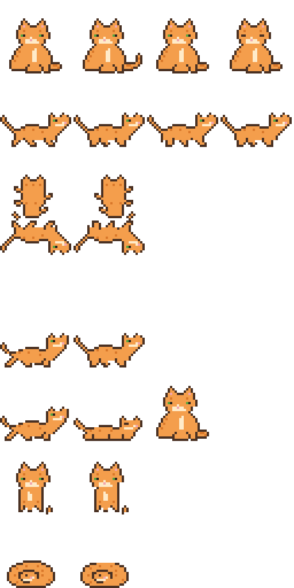

# 🐱 CatPetStation

**Open-source desktop pets that are safe by design.**

CatPetStation puts a little animated companion on your Windows desktop — it walks,
climbs the edges of your screen, hangs from the top, naps, and can be picked up
and flung around with the mouse. It ships with **Station Cat**, an original
MIT-licensed pixel cat, and can import community pet packs — including packs made
for the (now delisted) DPET : Desktop Pet Engine.



## Why another desktop pet app?

Desktop pets have a wonderful community and a rough distribution story. Popular
apps have been delisted, mascot packs get passed around as random zip downloads,
and "just run this exe" is the normal install experience. CatPetStation exists to
be the *good citizen* of this space:

| Principle | What it means here |
| --- | --- |
| **Assets are data, never code** | A pet pack is a PNG sprite sheet + a JSON manifest. Nothing in a pack can execute, ever. |
| **Hostile zips are expected** | The importer only extracts validated `.png`/`.json`, flattens hostile paths (zip-slip proof), checks PNG magic bytes, and enforces size limits. Everything else in an archive is skipped and *reported to you*. |
| **No network, no telemetry** | The app makes zero network calls. No accounts, no updater phoning home, no analytics. |
| **Stays out of your way** | Pets never steal focus, never appear in the taskbar or Alt+Tab, and nap at ~2 fps when told to. |
| **Runs unelevated** | The app manifest requests `asInvoker` — it never asks for admin. |
| **Everything reproducible** | Even the built-in cat's sprite sheet is generated from ASCII pixel grids in [`tools/SpriteGen`](tools/SpriteGen/CatArt.cs), so every byte of the repo is reviewable. |

## Features

- 🚶 Full behavior set: idle, walk, **climb screen edges**, **hang from the top**,
  jump, fall with real gravity, drag & **fling** with the mouse, nap.
- 🐈 Multiple pets at once, mix and match packs.
- 📦 **Pack import** with a DPET-compatible manifest reader — point it at a
  community `.zip` and only the safe parts come through.
- 🎚️ Pet sizes from Small to Chonk, all from the tray menu.
- 🪶 Single tray icon, no main window, tiny CPU footprint.

## Getting started

Requires Windows 10/11. Build from source (needs the [.NET 10 SDK](https://dotnet.microsoft.com/download)):

```bash
git clone https://github.com/bojordan/CatPetStation.git
cd CatPetStation
dotnet run --project src/CatPetStation.App
```

Station Cat drops onto your desktop from the top of the screen. Right-click the
cat for pet options; right-click the tray icon for everything else.

### Importing a pet pack

1. Tray icon → **Import pet pack (.zip)…**
2. Pick the zip. CatPetStation extracts *only* validated sprite sheets and
   manifests and shows you a report of everything it skipped and why.
3. The imported pet appears immediately and is stored in
   `%APPDATA%\CatPetStation\packs`.

Got assets for a pet made for DPET? They import unchanged — the DPET JSON dialect
(`name`/`img`/`width`/`height`/`animePos`) is read natively. See
[docs/SAFE-IMPORT.md](docs/SAFE-IMPORT.md) for how to handle downloads from
untrusted sources *before* they ever reach the importer.

## Documentation

- [Architecture](docs/ARCHITECTURE.md) — how the engine, importer, and app fit together
- [Pet pack format](docs/ASSET-PACKS.md) — make your own pet
- [Safe importing](docs/SAFE-IMPORT.md) — handling community asset dumps responsibly
- [Development log](docs/DEVLOG.md) — how this project was built, decision by decision
- [Security policy](SECURITY.md) — threat model and how to report issues
- [macOS port plan](ports/macos/README.md) — the Swift/AppKit sibling app

## Contributing

Pets, art, behaviors, and ports are all welcome — see
[CONTRIBUTING.md](CONTRIBUTING.md). The one hard rule: **only submit art you have
the rights to submit**, under a license that allows redistribution. Fan art of
copyrighted characters belongs in personal packs folders, not in this repo.

## License

[MIT](LICENSE) — the code *and* the built-in Station Cat art.
